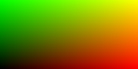
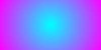
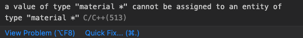
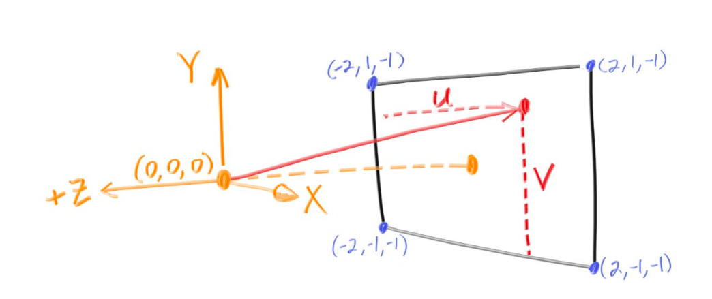
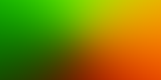
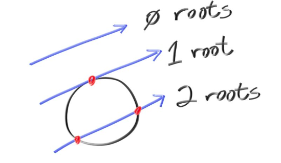
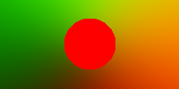
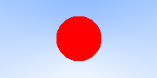
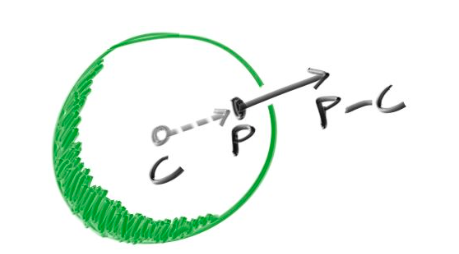

# Balls and More: Experiments With Ray Tracers


## Yapping and background
Last semester I worked with Neural Radiance Fields for my project with Prof. Sundaresan Raman (as it happens with most SOPs at BITS, the project didn't really go anywhere and I should be getting an A regardless :) )

I treated the graphics rendering part of the NeRF pipeline as a blackbox and the neural architecture itself as just a function approximator for an abstract plenoptic function (link).

Until some time ago when I came across Peter Shirley's (link) Ray Tracing Weekend Series and made a rudimentary ray tracer of my own.

## Viewing the image and the PPM format

The first thing we will do is to set up how we are going to view the images. To do this, we will write values to a file in the PPM (Portable Pixmap) format. To have a taster write the following in a .ppm file.

```
P3
3 2
255
255 0 0 0 255 0 0 0 255
255 255 0 255 255 255 0 0 0
```

To view a PPM file I am using an extension within VS Code. The output looks like:
(image)

Now lets write a PPM file using code:
```cpp
#include <iostream>
#include <fstream>
using namespace std;

int main(){
    int nx = 200; //image width
    int ny = 100; //image height
    ofstream myfile;
    myfile.open ("image.ppm");
    myfile << "P3\n" << nx << " " << ny << "\n255\n";
    for(int j = ny-1; j>=0; j--){
        for(int i=0; i<nx; i++){
            clog << "\rScanlines remaining: " << (ny - j) << ' ' << flush; //used as a progres bar
            double r = (double)i/(nx-1); //red channel
            double g = (double)j/(ny-1); //green channel
            double b = 0.0; //blue channel
            int ir = int(255.999 * r);
            int ig = int(255.999 * g);
            int ib = int(255.999 * b);
            myfile << ir << " " << ig << " " << ib << "\n";
        }
    }
    clog << "\rDone.                 \n";
    myfile.close();
}
```

running the following command in the directory containig your file:
```bash
g++ <filename>.cpp \
&& ./a.out \
&& code image.ppm
```

Outputs  the following image:



The code lines:
```cpp
double r = (double)i/(nx-1); //red channel
double g = (double)j/(ny-1); //green channel
double b = 0.0; //blue channel
```
define the gradient logic and you can try playing around with this. For example:

```cpp
int center_x = nx/2;
int center_y = ny/2;
double max_dist = sqrt(nx/2 * nx/2 + ny/2 * ny/2);
for(int j = ny-1; j>=0; j--){
    for(int i=0; i<nx; i++){
        int dist = sqrt((i-center_x)*(i-center_x) + (j-center_y)*(j-center_y));
        double r = dist/max_dist; //red channel
        double g = 1.0-(dist/max_dist); //green channel
        double b = 1.0; //blue channel
        ...
    }
}
```
outputs this circular gradient:




## The vec3 Class

We will be creating a class called vec3 the objects of which stores three float values corresponding to rgb. This is my `vec3.h` file:

```cpp
#ifndef VEC3H
#define VEC3H

#include <math.h>
#include <stdlib.h>
#include <iostream>

class vec3 {
public:
    vec3() {}
    vec3(float e0, float e1, float e2) { e[0] = e0; e[1] = e1; e[2] = e2; }
    inline float x() const { return e[0]; }
    inline float y() const { return e[1]; }
    inline float z() const { return e[2]; }
    inline float r() const { return e[0]; }
    inline float g() const { return e[1]; }
    inline float b() const { return e[2]; }

    inline const vec3& operator+() const { return *this; }
    inline vec3 operator-() const { return vec3(-e[0], -e[1], -e[2]); }
    inline float operator[](int i) const { return e[i]; }
    inline float& operator[](int i) { return e[i]; }

    inline vec3& operator+=(const vec3 &v2);
    inline vec3& operator-=(const vec3 &v2);
    inline vec3& operator*=(const vec3 &v2);
    inline vec3& operator/=(const vec3 &v2);
    inline vec3& operator*=(const float t);
    inline vec3& operator/=(const float t);

    inline float length() const { return sqrt(e[0]*e[0] + e[1]*e[1] + e[2]*e[2]); }
    inline float squared_length() const { return e[0]*e[0] + e[1]*e[1] + e[2]*e[2]; }
    inline void make_unit_vector();

    float e[3];
};
inline std::istream& operator>>(std::istream &is, vec3 &t) {
    is >> t.e[0] >> t.e[1] >> t.e[2];
    return is;
}

inline std::ostream& operator<<(std::ostream &os, const vec3 &t) {
    os << t.e[0] << " " << t.e[1] << " " << t.e[2];
    return os;
}

inline void vec3::make_unit_vector() {
    float k = 1.0 / sqrt(e[0]*e[0] + e[1]*e[1] + e[2]*e[2]);
    e[0] *= k; e[1] *= k; e[2] *= k;
}

inline vec3 operator+(const vec3 &v1, const vec3 &v2) {
    return vec3(v1.e[0] + v2.e[0], v1.e[1] + v2.e[1], v1.e[2] + v2.e[2]);
}

inline vec3 operator-(const vec3 &v1, const vec3 &v2) {
    return vec3(v1.e[0] - v2.e[0], v1.e[1] - v2.e[1], v1.e[2] - v2.e[2]);
}

inline vec3 operator*(const vec3 &v1, const vec3 &v2) {
    return vec3(v1.e[0] * v2.e[0], v1.e[1] * v2.e[1], v1.e[2] * v2.e[2]);
}

inline vec3 operator/(const vec3 &v1, const vec3 &v2) {
    return vec3(v1.e[0] / v2.e[0], v1.e[1] / v2.e[1], v1.e[2] / v2.e[2]);
}

inline vec3 operator*(float t, const vec3 &v) {
    return vec3(t*v.e[0], t*v.e[1], t*v.e[2]);
}

inline vec3 operator/(vec3 v, float t) {
    return vec3(v.e[0]/t, v.e[1]/t, v.e[2]/t);
}

inline vec3 operator*(const vec3 &v, float t) {
    return vec3(t*v.e[0], t*v.e[1], t*v.e[2]);
}

inline float dot(const vec3 &v1, const vec3 &v2) {
    return v1.e[0] *v2.e[0] + v1.e[1] *v2.e[1]  + v1.e[2] *v2.e[2];
}

inline vec3 cross(const vec3 &v1, const vec3 &v2) {
    return vec3(v1.e[1] * v2.e[2] - v1.e[2] * v2.e[1],
                v1.e[2] * v2.e[0] - v1.e[0] * v2.e[2],
                v1.e[0] * v2.e[1] - v1.e[1] * v2.e[0]);
}

inline vec3& vec3::operator+=(const vec3 &v){
    e[0]  += v.e[0];
    e[1]  += v.e[1];
    e[2]  += v.e[2];
    return *this;
}

inline vec3& vec3::operator*=(const vec3 &v){
    e[0]  *= v.e[0];
    e[1]  *= v.e[1];
    e[2]  *= v.e[2];
    return *this;
}

inline vec3& vec3::operator/=(const vec3 &v){
    e[0]  /= v.e[0];
    e[1]  /= v.e[1];
    e[2]  /= v.e[2];
    return *this;
}

inline vec3& vec3::operator-=(const vec3& v) {
    e[0]  -= v.e[0];
    e[1]  -= v.e[1];
    e[2]  -= v.e[2];
    return *this;
}

inline vec3& vec3::operator*=(const float t) {
    e[0]  *= t;
    e[1]  *= t;
    e[2]  *= t;
    return *this;
}

inline vec3& vec3::operator/=(const float t) {
    float k = 1.0/t;

    e[0]  *= k;
    e[1]  *= k;
    e[2]  *= k;
    return *this;
}

inline vec3 unit_vector(vec3 v) {
    return v / v.length();
}

#endif
```

It defines all the necessary constructors, operations, and methods that we will require to manipulate rgb values. Make sure to use header guards, otherwise you might run into problems like this which are a pain to debug 🙃



Now we can change our main function to use vec3:

```cpp
#include <iostream>
#include <fstream>
#include "vec3.h"
using namespace std;

int main(){
    int nx = 200;
    int ny = 100;
    ofstream myfile;
    myfile.open ("image.ppm");
    myfile << "P3\n" << nx << " " << ny << "\n255\n";
    for(int j = ny-1; j>=0; j--){
        for(int i=0; i<nx; i++){
            vec3 col((float)i/nx, (float)j/ny, 0.2);
            int ir = int(255.99*col[0]);
            int ig = int(255.99*col[1]);
            int ib = int(255.99*col[2]);
            myfile << ir << " " << ig << " " << ib << "\n";
        }
    }
    myfile.close();
}
```
## The Ray Class

Next we will set up our ray class. A ray is a  parameterised vec3. Such that $P(t)$ returns a vec3 value. Each ray has an origin vector $A$ and a direction vector $B$ (not necessarily a unit vector), and hence:
$P(t) = A + tB$. The ray class will have a method that for a given $t$ outputs the corresponding vector. Notice, that $t$ can be negative.

_Hence, and this is the notation used henceforth, a vector (a vec3) is a collection of 3 float values, while a ray is a collection of vectors (vec3s) along a straight line_

Here is my `ray.h` file:
```cpp
#ifndef RAYH
#define RAYH
#include "vec3.h"

class ray
{
    public:
        ray() {}
        ray(const vec3& a, const vec3& b) { A = a; B = b; }
        vec3 origin() const       { return A; }
        vec3 direction() const    { return B; }
        vec3 point_at_parameter(float t) const { return A + t*B; }

        vec3 A;
        vec3 B;
};

#endif
```
The ray class is fundamental to raytracing. The camera (the common origin to all rays) shoots out a ray corresponding to each pixel in the image. For example if the ray intersects with an object in the foreground the ray outputs the color of the object.

So we will now set up a helper `color()` function that uses a ray and outputs a vec3 value corresponding to the color it contributes. Initially, since there are no objects to hit the function will output a "background" which will be a simple gradient like we set up earlier. I directly implement the `color()` function in the main() file, but you can also make a `color.h` file.

We will set up the screen with dimensions $(-2, -1, -1), (-2, 1, -1), (2, 1, -1), (2, -1, -1)$ where $z=-1$ signifies that the camera is 1 unit above the screen.



```cpp
vec3 color(ray& r){
    vec3 origin = r.origin();
    vec3 direction = unit_vector(r.direction());
    float red = 0.5*(float)(direction.x() + 1);
    float green = 0.5*(float)(direction.y() +1);
    float blue = 0.0;
    return vec3(red,green,blue);
}
```

using which with `main()` after setting up the origin and the image dimensions like such:
```cpp
int main(){
    int nx = 200;
    int ny = 100;
    ofstream myfile;
    myfile.open ("image.ppm");
    myfile << "P3\n" << nx << " " << ny << "\n255\n";
    vec3 lower_left_corner(-2.0, -1.0, -1.0);
    vec3 horizontal(4.0, 0.0, 0.0);
    vec3 vertical(0.0, 2.0, 0.0);
    vec3 origin(0.0, 0.0, 0.0);
    for(int j = ny-1; j>=0; j--){
        for(int i=0; i<nx; i++){
            float u = float(i) / float(nx);
            float v = float(j) / float(ny);
            ray r(origin, lower_left_corner + u*horizontal + v*vertical);
            vec3 col = color(r);
            int ir = int(255.99*col[0]);
            int ig = int(255.99*col[1]);
            int ib = int(255.99*col[2]);
            myfile << ir << " " << ig << " " << ib << "\n";
        }
    }
    myfile.close();
}
```
outputs this gradient:



Notice this part of the code:
`float red = (float)(direction.x() + 1);`. `red` needs to be a value between $0$ and $1$

`direction` is a unit vector hence:

$$
-1 < \text{direction.x()} < 1
$$

$$
0 < \text{direction.x()} + 1 < 2
$$

$$
0 < 0.5(\text{direction.x()} + 1) < 1
$$

## Getting closer to balls: making a sphere

We will now make a sphere, and any ray that hits the sphere will output red color (so, we should be seeing a red sphere on the screen).

A sphere, with centre as $c(x,y,z)$ is parameterised as: 
$$(x-cx)^2 + (y-cy)^2 + (z-cz)^2 = R^2$$
 
Rewriting this using ray notation, a ray hits a sphere if 

$$
\exists t[(P(t) \cdot x-cx)^2 + (P(t) \cdot y-cy)2 + (P(t) \cdot z-cz)^2 = R^2]
$$

Using vector calculus this translates to:

$$\exists t[dot((P(t)-c), (P(t)-c)) = R^2]$$

expanding which becomes:
$$
\exists t[dot(A+t*B-C), dot(A+t*B-C)=R^2]
$$
$$
\implies \exists t[t^2*dot(B, B) + 2t*dot(B, A-C) + dot(A-C, A-C)-R^2=0]
$$

Notice, that the condition is a quadratic equation in t, and is satisfied when the discriminant is non negative.



Hence, we can now create a function with the signature `bool hits_sphere(const vec3& center, float radius, const ray& r)`

```cpp
bool hit_sphere(const vec3& center, float radius, const ray& r){
    vec3 oc  = r.origin() - center;
    float a = dot(r.direction(), r.direction());
    float b = 2.0 * dot(oc, r.direction());
    float c = dot(oc, oc) - radius*radius;
    float discriminant = b*b - 4*a*c;
    return (discriminant > 0);
}
```

and modifying our color function, we will output red for any ray hitting the sphere:

```cpp
vec3 color(const ray& r) {
        if(hit_sphere(vec3(0,0,-1), 0.5, r)){
            return vec3(1,0,0);
        }
        vec3 origin = r.origin();
        vec3 direction = unit_vector(r.direction());
        float red = 0.5*(float)(direction.x() + 1);
        float green = 0.5*(float)(direction.y() +1);
        float blue = 0.0;
        return vec3(red,green,blue);
}
```

the `main()` remains unchanged, and the output is:



Yay, it works, but also looks like the Bangladeshi flag which is an aesthetic chocie im not taking to my grave, so i will be using another `color()` that linearly interpolates blue hues depending on the $y$ value:
```cpp
vec3 color(const ray& r) {
        if(hit_sphere(vec3(0,0,-1), 0.5, r)){
            return vec3(1,0,0);
        }
        vec3 unit_direction = unit_vector(r.direction());
        float t = 0.5*(unit_direction.y() + 1.0);
        return (1.0-t)*vec3(1.0, 1.0, 1.0) + t*vec3(0.5, 0.7, 1.0);
}
```


Much better, but this is still just a... circle, which makes sense bcs we have fundamentally just projected a sphere onto our screen. But we can use _surface normals_ to give this sphere a sense of shading, and reflection.

## Surface Normals

This is a surface normal:



In our code we will have surfance normals be unit vectors, and map each component to be between 0 and 1 and then correspond them to rgb.

Only those points will be illuminated which are hit by a ray (and for a ray hitting two points, we will consider the one closer to the camera, which corresponds to the one with smaller $t$), and so along with a function to tell if a ray hits a sphere, we also need the hit point.

```cpp
float hit_sphere_at_t(const vec3& center, float radius, const ray& r){
    if (!hit_sphere(center, radius, r)) {
        return -1.0;
    }
    else {
        return (-b - sqrt(discriminant) ) / (2.0*a);
    }
}
```

and the `color()` function changes to:
```cpp
vec3 color(const ray& r) {
    float t = hit_sphere_at_t(vec3(0,0,-1), 0.5, r);
    if (t > 0.0) {
        vec3 N = unit_vector(r.point_at_parameter(t) - vec3(0,0,-1)); //(0,0,-1) is the hard coded centre of the sphere
        return 0.5*vec3(N.x()+1, N.y()+1, N.z()+1);
    }
    vec3 unit_direction = unit_vector(r.direction());
    t = 0.5*(unit_direction.y() + 1.0);
    return (1.0-t)*vec3(1.0, 1.0, 1.0) + t*vec3(0.5, 0.7, 1.0);
}
